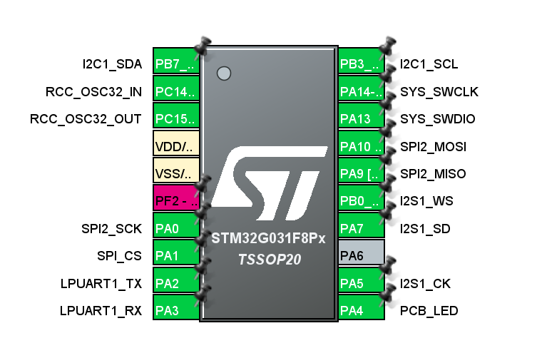

# STM32G031F8 評価F/W開発

## 開発環境

- マイコン: `STM32G031F8P6`
  - Flash: 64KB
  - SRAM: 8KB
- コンパイラ: Clang (`st-arm-clang 19.1.6`) 
  - 最適化: debug
- ツールチェイン
  - CMake
  - STM32CubeMX
  - STM32CubeIDE (VSCode版)
- デバッガ: `ST-LINK/V2-1`
  - デバッグI/F: SWD
  - UART: 115200bps 8N1

## ピンアサイン



## メモリ使用量

- Lチカとprintf()のみでのメモリ使用量

```shell
[build] Memory region         Used Size  Region Size  %age Used
[build]              RAM:        2160 B         8 KB     26.37%
[build]            FLASH:       16744 B        64 KB     25.55%
```
